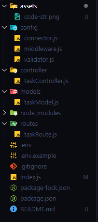

# TODO APP Backend - node js

## Table of contents

1. [Overview](#overview)
2. [Installation](#installation)
3. [How to use](#how-to-use)
4. [API Endpoints](#api-endpoints)
5. [Code Structure](#code-structure)
6. [Key Decisions](#key-decisions)

## Overview

This is a simple TODO-APP using nodejs, express and mongodb. 

## Installation

1. Clone the repository to your local machine.
   ```
   https://github.com/pkmanas22/TODO-APP-backend.git
   ```
2. Install the required dependencies.
   ```
   npm install
   ```
3. Create a `.env` file and copy the required environment variables from the `.env.example` file. You can use following command to create the `.env` file.
   ```
   cp .env.example .env
   ```
4. Update the required environment variables in the `.env` file. Must give your own values for `MONGO_URL`. Leave the `PORT` empty.

## How to use

To use this app, run the following command:

1. Start the server.
   ```
   npm run start
   ```
2. Start the server (for development)
   ```
   npm run dev
   ```

- If you follow the all steps mentioned above, then the app will be running on port `8000`. You can access the app by opening the following link in your browser:

  ```
  http://localhost:8000
  ```

- Navigate to [API Endpoints](#api-endpoints) section for more information about the API endpoints.

## API Endpoints

1. `GET` :: `/` :: Welcome message
2. `GET` :: `/api/v1/task` :: View a list of all tasks
3. `POST` :: `/api/v1/task/new` :: Create tasks with a title and description
   ```
   {
       "title": "Buy milk",
       "description": "Buy milk from the store"
   }
   ```
   Must provide below json data in the request body
4. `GET` :: `/api/v1/task/:id/complete` :: Mark tasks as completed
5. `PUT` :: `/api/v1/task/:id/edit` :: Edit task details

   ```
   {
       "title": "Buy milk",
       "description": "Buy milk from the store"
   }
   ```

   Must provide below json data in the request body

6. `GET` :: `/api/v1/task/:id/delete` :: Delete a task

[Note] : After creating todo by hitting `POST` endpoint, you can see the todo by hitting `GET` endpoint. You can also see all todos by hitting `GET` endpoint.

## Code Structure



1. `index.js`

   - Contains the code for starting the server and connecting to the database.

2. `package.json`

   - Contains the code for installing the required dependencies and describing the project.

3. `.env`

   - Contains the environment variables for the app.

4. `.env.example`

   - Contains the example of the environment variables for the app which does not contain the actual values.

5. `.gitignore`
   - Contains the files and directories to be ignored by git.
6. `config/`

   - Contains all the configuration files for the app. This includes `connector.js`, `middleware.js` and `validator.js` file.
   - `connector.js` contains the code for connecting to the database.
   - `middleware.js` contains the code for checking if the `id` exists or not for editing a task, marking a task as completed and deleting a task.
   - `validator.js` contains the code for validating the title field should not be empty.

7. `routes/`

   - Contains all the routes for the app. This includes `taskRoute.js` file.
   - `taskRoute.js` contains the definition of the API endpoints.

8. `models/`

   - Contains all the models for the app. This includes `taskModel.js` file.
   - `taskModel.js` contains the definition of the task model.

9. `controllers/`

   - Contains all the controllers for the app. This includes `taskController.js` file.
   - `taskController.js` contains the definition of the task controller.

10. `assets/`
    - Contains all the assets (images) for the app.

## Key Decisions

- I have used `MVC` pattern (Model-View-Controller) for the architecture of the app. This is a good practice for a simple app like this.

- I have used `MongoDB` for the database. As I have experience with MongoDB.

- I created `/api/v1/task` endpoint for this project. It is best practices if we want to use multiple versions of the API endpoints. Thus I include `v1` path.

- I added route for invalid URLs. It shows `404 Page not found` message if the URL is invalid.

- I added middleware for checking if the `id` exists or not for editing a task, marking a task as completed and deleting a task.

- I added a custom middleware for validating the title field should not be empty.

- I stored all the logic in one file.

- I used `try...catch` block for error handling.

- I gave each response a status code and a meaningful message.

## Thank you for reading.

Manas Kumar Pradhan